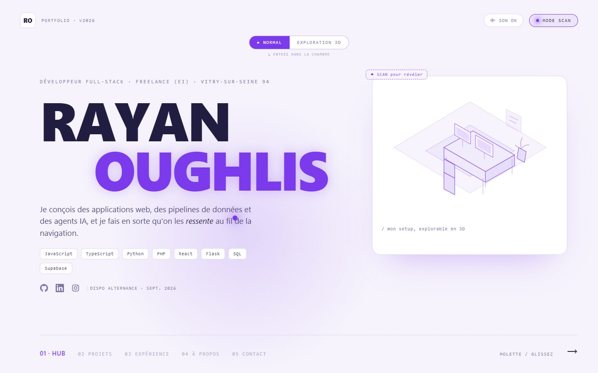
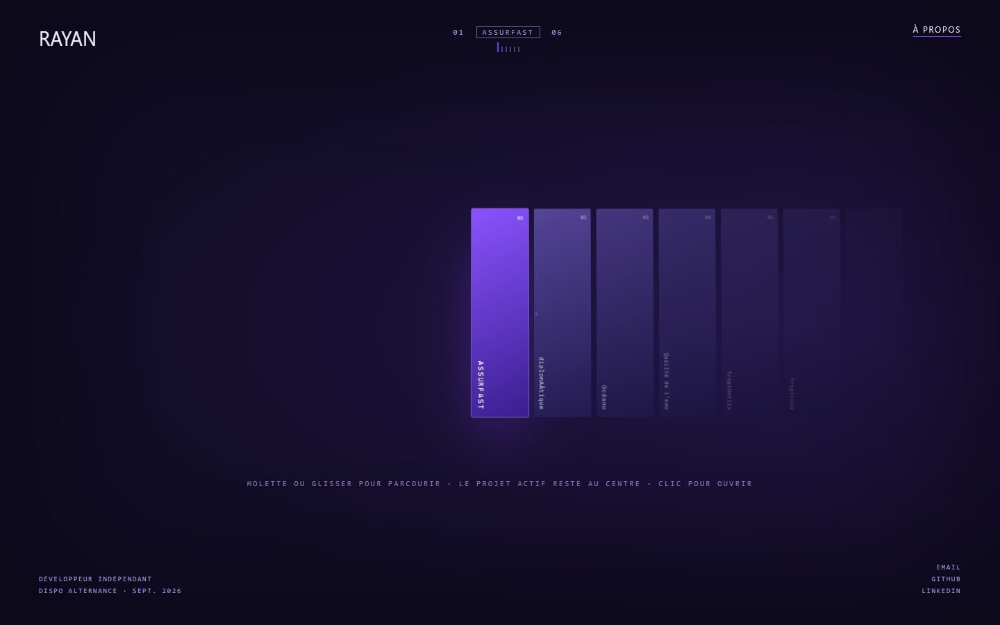
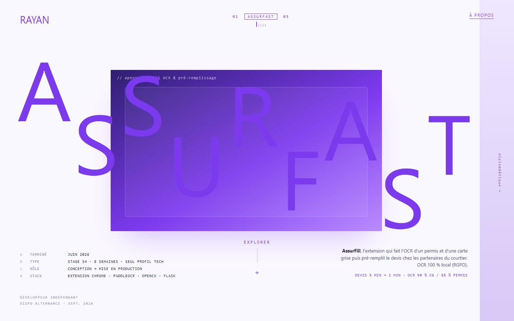
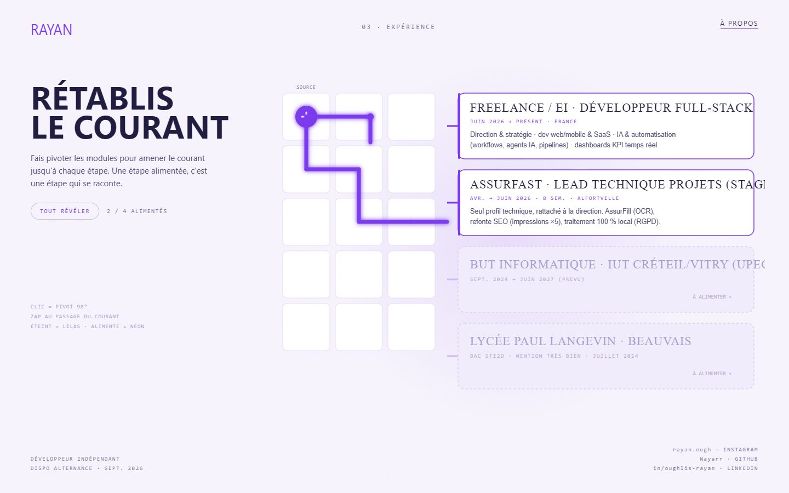
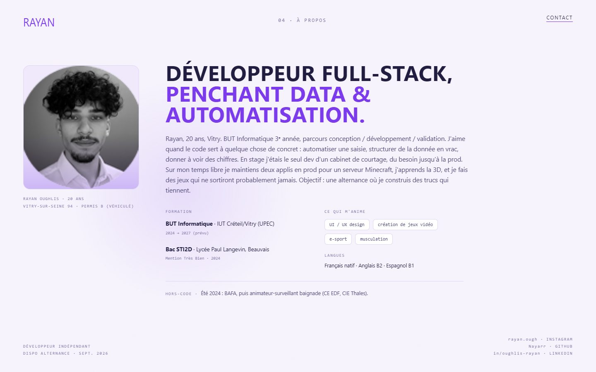

# Design

Maquette-concept de tous les ecrans. Rendus de reference dans `screens/`.

- **Source editable :** canvas Claude Design (multi-artboards). Les sources `.dc.html`
  restent en local (`design-mockup/`, non versionnees) et se re-exportent depuis le canvas.
- **Direction :** palette blanc + violet neon. Anton (display), Space Grotesk (UI),
  JetBrains Mono (data), Instrument Serif (editorial). Jetons dans `src/styles/tokens.css`.
- Les decisions liees sont dans `docs/adr/`.

## Parcours

| #   | Ecran                   | Fichier                             |
| --- | ----------------------- | ----------------------------------- |
| 01  | Hub (scroll)            | `screens/01-hub.jpg`                |
| 02  | Projets, pellicule      | `screens/04-projets-pellicule.jpg`  |
| --  | Projets, transition     | `screens/05-projets-transition.jpg` |
| --  | Projet deploye          | `screens/06-projet-deploye.jpg`     |
| --  | Projet, ecran explore   | `screens/07-projet-explore.jpg`     |
| --  | Projet, fiche detaillee | `screens/08-projet-fiche.jpg`       |
| 03  | Experience (circuit)    | `screens/09-experience.jpg`         |
| 04  | A propos                | `screens/10-a-propos.jpg`           |
| 05  | Contact                 | `screens/11-contact.jpg`            |

Mode scan abandonne, sa maquette reste a `screens/03-mode-scan.jpg`.
Pistes de style ecartees : `screens/ref-skin-cozy.jpg`, `screens/ref-skin-dedsec.jpg`.
Mode exploration 3D abandonne pour la v1 (voir ADR 0006), maquette conservee :
`screens/02-hub-exploration-3d.jpg`.

## Apercu

### 01, Hub

### 02, Projets

### 06, Projet deploye

### 09, Experience

### 10, A propos

